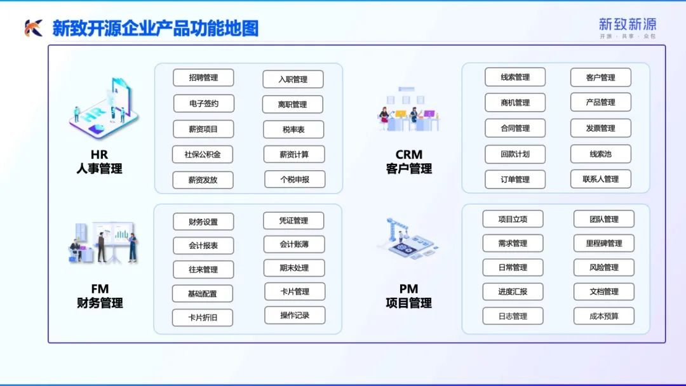

# 开源企业用户常见问题

更新日期：2024年5月6日

## 1.产品功能问题
### 1.1.开源企业产品有哪些功能？
以下为开源企业功能地图：

您可以关注【新致开源企业】公众号获取更多产品知识和演示视频：

## 1.2.开源企业产品适用于哪些企业？

开源企业的产品目前定位是面向千万中小企业，为其信息化落地，数字化转型提供产品能力。用户根据需要可以下载、部署源码直接使用，可以作为解决方案使用，也可以作为打造SAAS产品的基础版本使用。不管哪种方式，开源企业所有产品源码开源并提供相应技术支撑。通过基础架构+基础业务+开源运营，帮助企业可以低成本实现系统落地。

### 1.3.产品提供哪些延展接口？

开源企业4款产品架构均满足第三方系统接口对接。

## 2.签约下载问题
### 2.1.如何下载源代码和签约？

请您登陆开源企业官网[opencom.com.cn](http://opencom.com.cn)，注册账户后，点击任一产品进入产品下载页，点击【签约】完成在线免费许可签约，然后再点击【下载】即可下载对应代码包、安装包和技术文档。
请注意您在线签署的是 **个人/团队学习、教学、研究等非商业用途** 的许可协议，如需商用请联系我们获取商用许可。

### 2.2.下载文件后如何打开？
所有文件下载后请改文件后缀名为.zip再解压缩打开。
### 2.3.下载新版本是否需要再次签约？
不需要，官网签约一次即可下载全部版本。
### 2.4.是否有产品演示系统/演示视频？
演示系统地址在官方签约群里共享。您在官网完成签约后，请扫码添加产品下载页的小助手客服微信号申请进群。
演示视频可以关注公众号【新致开源企业】获取。

### 2.5.如何进行产品技术咨询？
您可以在官方签约群里进行技术咨询和交流。您在官网完成签约后，请扫码添加产品下载页的小助手客服微信号申请进群。

### 2.6.老版本如何升级为新版本?
新版本需要重新从官网下载并且重新部署。
### 2.7.浏览器提示无法安全下载？
如您的浏览器出现以下提示：

解决方案：点击右侧【···】按钮，点击【保留】即可下载

## 3.商务合作问题
### 3.1.开源软件是免费的吗？
您在本网站签署的是免费许可协议，仅适用于个人/团队学习、教学、研究等非商业用途。
如您需要商用（包括企业自用、源码直接售卖、二次开发后售卖等情况），需要联系我们线下获取商用许可，并支付相应的商用许可费用。
### 3.2.如何获取商用许可？
如需获取商用许可，请在线登记合作需求，我们将尽快联系您。
### 3.3.商用许可费用如何计算？
开源企业商用许可标准费用：
商用许可费（元/套/家）
财务管理	15000
人事管理	20000
客户管理	5000
项目管理	5000
商用许可方式说明：
●商用许可适用于源代码本地部署的场景，如您的企业自行采购部署，单个产品单个版本仅需支付一次商用许可费，产品类型和版本以线下商用协议为准。
●生态合作伙伴（软件公司等）如需将代码应用于客户本地化部署时，应按照实际部署客户数量支付同等标准的商用许可费，具体以线下商用协议为准。
●生态合作伙伴如需将代码二次开发为SaaS产品，请联系我们线下沟通合作模式。
### 3.4.商用许可费用是一次性支付还是年费？
商用许可内容是单个产品单个版本，费用为一次性支付。
如需产品更新版本，需要另行支付新版本商用许可费用，具体以线下沟通确认为准。
### 3.5.我下载源码后是否可以二次开发/部署后卖给其他机构？
可以的，您需要联系我们线下签订商用许可协议，即可进行商业售卖。
两种商业售卖方式：
●本地化部署：您需要按照实际部署的客户数量支付相应的商用许可费用。
●SaaS订阅：请联系我们线下沟通合作模式。
### 3.6.我是一家软件公司，如何与开源企业合作？
您可以成为我们的生态合作伙伴，只需支付标准商用许可费用，即可基于我们提供的源码二次开发并商业售卖。
商用许可费用非常实惠，相比您自行开发，使用开源软件预期将为您节省数十万元的开发成本。
同时，我们将会在官网及各类渠道展示生态合作伙伴的产品及解决方案，也将为您带来潜在客户商机。
如需申请合作，请在线登记合作需求，我们将尽快联系您。
### 3.7.我司自身采购使用，如何与开源企业合作？
分为两种情况。
第一种：如果贵司有技术人员能够自行部署，仅需联系我们线下获取商用许可，并支付标准商用许可费用即可。
第二种：如果贵司没有技术人员，我们可能根据您的情况为您推荐第三方技术支持，合作是否达成需要根据具体沟通而定；如达成合作，您将与第三方直接签订合同，我们向第三方收取商用许可费用。并且，您部署使用的软件运维服务将由第三方提供，开源企业不提供运维服务。
如需申请合作，请在线登记合作需求，我们将尽快联系您。
### 3.8.我司自身采购使用，能不能直接购买账号？
目前开源企业仅提供源码，不提供SaaS订阅或任何租户服务，建议选择其他SaaS产品。
### 3.9.我是一个代理商，但我没有技术能力，如何与开源企业合作？
开源企业提供的是源码和安装包，业务人员无法直接使用，需要技术人员进行部署。
如果您没有部署能力，我们可能根据您的客户情况推荐第三方技术支持，合作是否达成需要根据具体沟通而定；如达成合作，您将与第三方直接签订合同，我们向第三方收取商用许可费用。

## 4.系统部署问题
### 4.1.在哪里获取部署教程？
官网上每个产品均有对应的技术文档供下载，您也可以在签约群获取更多信息。

### 4.2.产品支持什么操作系统？
产品支持linux系统。
### 4.3.产品支持部署在国产麒麟操作系统上吗？
可以。
### 4.4.产品可以部署桌面端吗？
开源企业目前产品均没有桌面端，只有网页端，即浏览器访问应用。
### 4.5.产品部署的服务器有要求吗？
具体要求需根据用户的体量来判断，条件允许配置越高越好。
产品部署服务器：CPU16核32G，500G硬盘，带宽5M。
数据库服务器：CPU8核16G，500G硬盘，带宽5M。

### 4.6.产品安装需要先安装数据库吗？
系统运行需要安装数据库，用户可以在网上自行下载MySQL 数据库安装。
### 4.7.演示系统版本是否为最终交付版本？
是交付的版本。
## 5.技术架构问题
### 5.1.产品是什么语言开发的？
产品采用java语言开发。
### 5.2.产品只有B/S架构吗？
是的。
### 5.3.产品采用微服务架构吗？
是的。

### 5.4 新问题
收拾收拾
